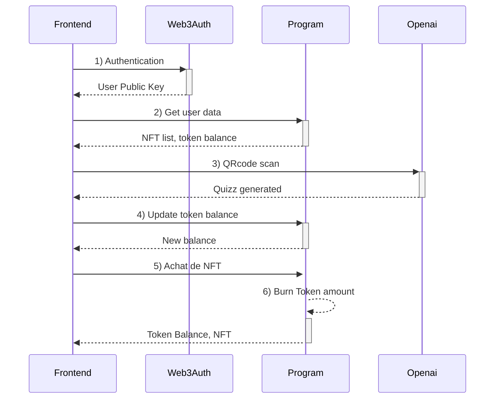

# Front-End de GemQuest

## Présentation

Le front-end de GemQuest offre une interface utilisateur réactive et performante développée avec React et Next.js. Il intègre des solutions avancées pour l'authentification et la génération de contenu interactif, fournissant une expérience utilisateur riche et immersive.

## Technologies Utilisées

- **React** : Utilisé pour construire des composants UI réactifs et gérables, facilitant une expérience utilisateur fluide.
- **Next.js** : Optimise le rendu côté serveur pour améliorer les performances et le référencement SEO, tout en simplifiant la gestion des routes et des API.
- **Web3Auth** : Permet une authentification sécurisée et facile en utilisant des wallets cryptographiques, essentielle pour intégrer des fonctionnalités liées à la blockchain et faciliter l'adoption.
- **OpenAI** : Employé pour générer des quizz de manière dynamique, offrant un contenu personnalisé et interactif aux utilisateurs.

## Flux d'Interaction (Diagramme de Séquence)

Le diagramme suivant illustre le flux d'interactions dans l'application, démontrant comment les différentes technologies s'articulent pour fournir une expérience utilisateur complète :



Ce diagramme met en évidence le processus d'authentification, la récupération des données, la génération de contenu, et les transactions liées aux NFTs, illustrant une séquence fluide et sécurisée d'opérations.

## Configuration et Déploiement

Pour configurer et démarrer le front-end de GemQuest localement, suivez ces étapes :

1. **Clonez le dépôt et naviguez dans le dossier du front-end** :

   ```bash
   git clone https://github.com/Crypt0zauruS/gemquest
   cd gemquest/frontend
   ```

2. **Installez les dépendances** :
   ```bash
   npm install
   ```
   ou
   ```bash
   yarn install
   ```
3. **Configurez les variables d'environnement** :

   > petit rappel

   - Copiez le fichier `.env.local.example` en `.env` et ajustez les variables nécessaires.

4. **Lancez le serveur de développement** :
   ```bash
   npm run dev
   ```
